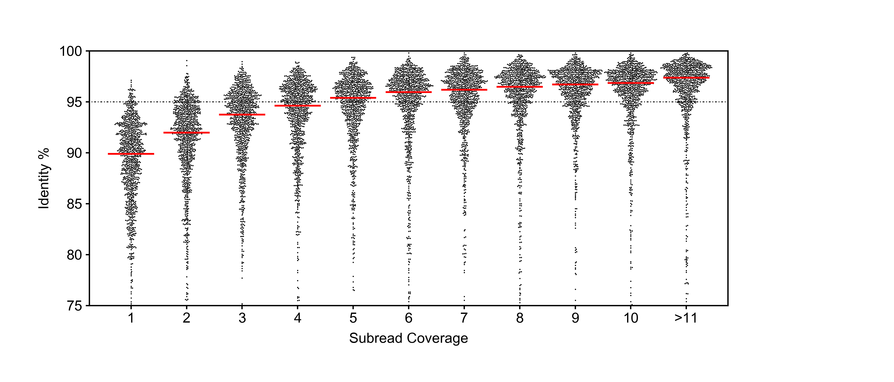

# Custom swarm plot function

##  Situation: 
As part of my BS in Biomolecular Engineering and Bioinformatics, I took an upper-division/graduate-level data visualization class taught by Professor Christopher Vollmers. In this class, we parsed through and visualized a variety of complex biological data using Python and Matplotlib. We were taught best practices when it comes to creating plots that are:
1. Easy to read
2. Easy to interpret
3. Not misleading

## Task:
For the fourth assignment, I was tasked to create my own swarm plot function. To do this, I needed to write an algorithm that efficiently places data points that don't overlap, and whose y-axis location is determined by the points that have already been plotted. 

## Action:
I wrote a python script that can be called via the terminal. It accepts three parameters: Input file, output file, and a Matplotlib style sheet file. 
1. The file is parsed and the subread quantity and accuracy values are extracted.  
2. The algorithm plots each point one at a time and in the exact desired location.To the left or right(whichever is closer to the center) and with no overlaps.
```python
for y in yList:
        printed = False
        shift = 0
        while not printed:
            hitR = False
            for otherPointR in plottedPointsR:
                if y != otherPointR[1]:
                    xDistInchR = ((((x + shift) - otherPointR[0]) / xRange) * panelWidth)
                    yDistInchR = (((y - otherPointR[1]) / yRange) * panelHeight)
                    markerSizeInches = markerSize / 72
                    distanceR = np.sqrt(xDistInchR ** 2 + yDistInchR ** 2)
                    if distanceR <= markerSizeInches:
                        hitR = True
                        hitL = False
                        for otherPointL in plottedPointsL:
                            if y != otherPointL[1]:
                                xDistInchL = ((((x - shift) - otherPointL[0]) / xRange) * panelWidth)
                                yDistInchL = (((y - otherPointL[1]) / yRange) * panelHeight)
                                distanceL = np.sqrt(xDistInchL ** 2 + yDistInchL ** 2)
                                if distanceL <= markerSizeInches:
                                    hitL = True
                                    break
                        if not hitL:
                            panel1.plot(x - shift, y,
                                        marker='o',
                                        markerfacecolor=(0, 0, 0),
                                        markeredgecolor='black',
                                        markersize=markerSize,
                                        markeredgewidth=0,
                                        linewidth=0)
                            if shift == 0:
                                plottedPointsR.append((x, y))
                                plottedPointsL.append((x, y))
                            plottedPointsL.append((x - shift, y))
                            printed = True
                            break
                        else:
                            break
            if not hitR:
                panel1.plot(x + shift, y,
                            marker='o',
                            markerfacecolor=(0, 0, 0),
                            markeredgecolor='black',
                            markersize=markerSize,
                            markeredgewidth=0,
                            linewidth=0)
                if shift == 0:
                    plottedPointsR.append((x, y))
                    plottedPointsL.append((x, y))
                plottedPointsR.append((x + shift, y))
                printed = True
            else:
                shift += markerSizeInches / 3
```
3. A random subset of the data is taken that is sufficiently large to provide a good statistical significance. Running 2,000+ points is not recommended. 

## Results:

A swarm plot function that is superior to any premade package available at the time(2020). Not only is the performance better than other swarm plot functions, the fact that I wrote the function means that I can fully customize it. 
